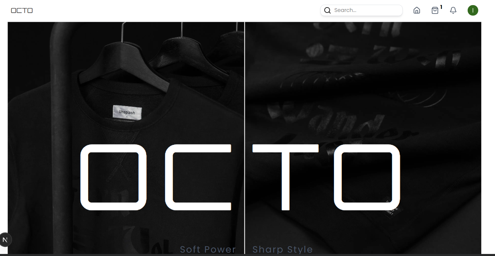
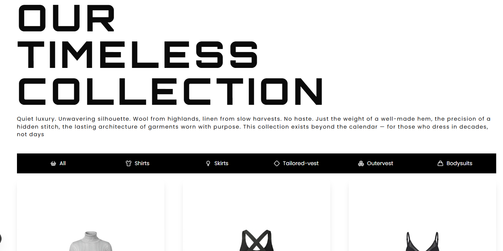
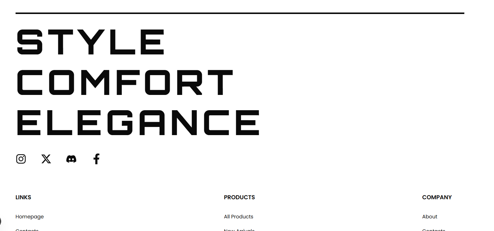
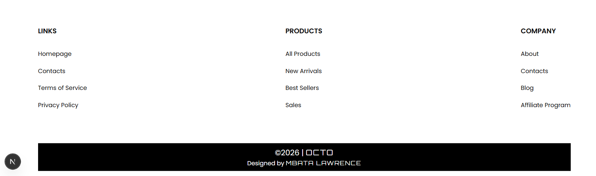
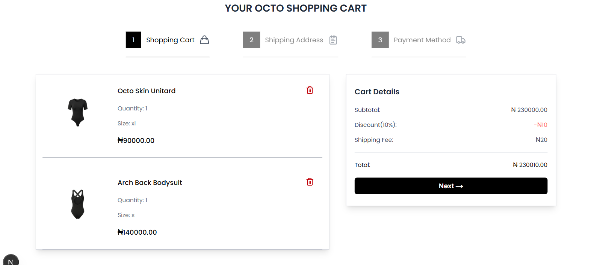
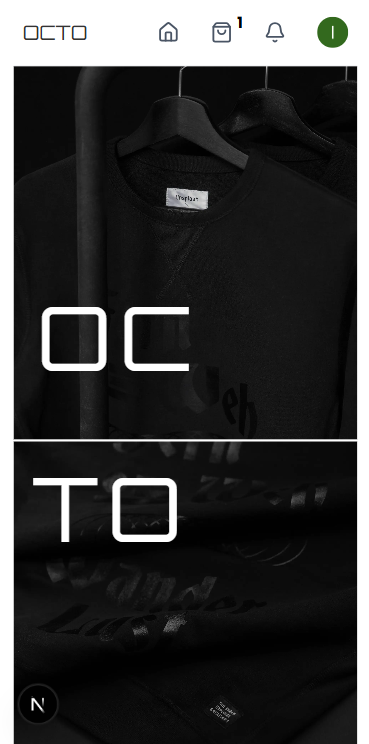
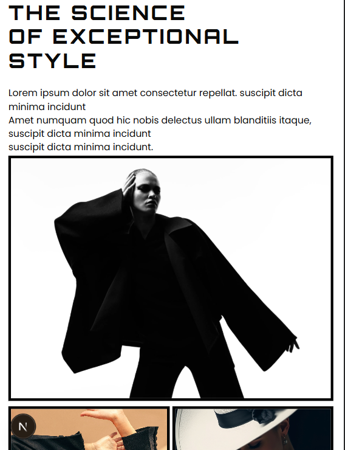
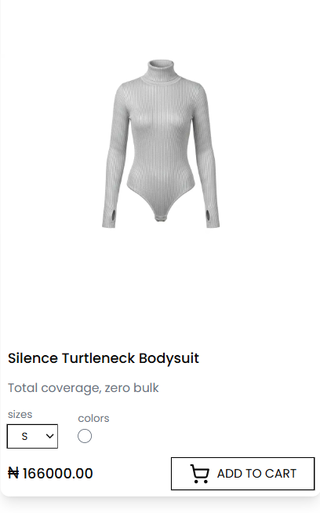
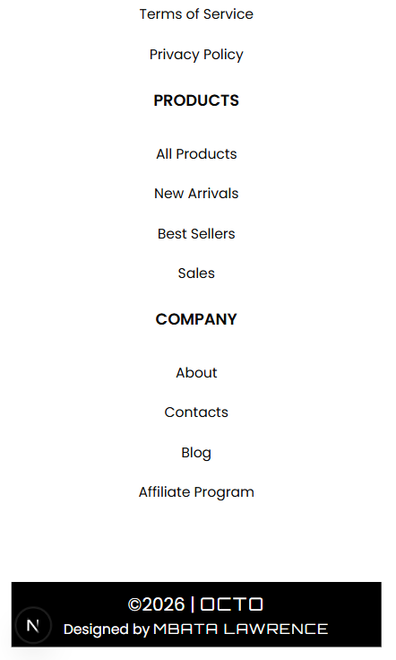

# A E_COMMERCE CLIENT APP
A production-ready, modern e-commerce frontend with seamless cart management, stunning UI animations, and enterprise-grade state management powered by Zustand. 

## Table of Content
1. Project Overview
2. Technologies
3. Project ScreenShots
4. Acknowledgments

## Project Overview 
The e-commerce website is a modern, scalable online shopping platform. The platform is a technology device merchant that has a portfolio of various high fashion products. 
The platform allows users to browse fashion products by category and search for a specific product, it also has cart functionality to be able to add products and remove product. By extension it has a checkout menu that sums up consumers products and its billing, which the proceeds to the Paystack payment portal.

### 🎨 UI/UX Excellence
- **Fully responsive design** - Mobile-first, flawless on all devices
- **Micro-animations** - Smooth transitions, hover effects, and loading skeletons
- **Infinite scroll** - Effortless product browsing
- **Toast notifications** - Real-time feedback for cart actions
- **Smart search** - Debounced, fuzzy matching, recent searches
- **Advanced filters** - Price range, ratings, categories, brands

### 🛒 Smart Cart Management (Zustand)
- **Persistent cart** - Items survive page refresh (localStorage)
- **Quantity management** - Increment/decrement with stock validation
- **Price calculations** - Real-time subtotal, tax, shipping, discounts

## Technologies

| Technology   | Description |
| ------------ | ----------- |
| Next.js  | For building the user interface.   |
| Zustand    | State management for managing global application state.   |
| Tailwind  | For styling.   |

## Products ScreenShots
These are the screenshot images of the design of the web Project.

#### Web

#### Mobile

## Acknowledgments
Special thanks to the open-source community for providing the tools and libraries used in this project.